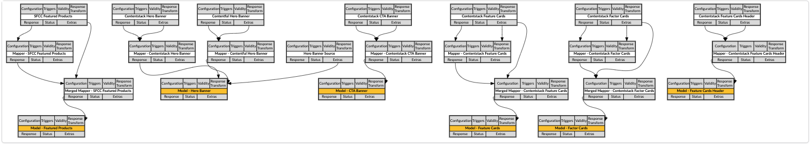

# Conscia.ai Integration

Conscia’s zero-code Digital Experience Orchestration (DXO) platform enables brands and organizations to fast-track the adoption of MACH and composable architecture into their existing tech stacks. For marketing, it offers centralized omnichannel control over the composable experience, with Personalization and A/B testing built in. For engineering teams, it offers zero code API and data orchestration, offloading the point to point integrations to the orchestration layer, simplifying the frontend code, and eliminating the need to build custom BFFs (Backend for Frontends). Conscia’s revolutionary approach embraces both legacy and modern backends, allowing it to act as the bridge between any backend and any frontend, and for this reason, justifiably claims the role of the ‘Brain’ of the Composable stack.

This integration demonstrates Conscia's ability to orchestrate multiple data sources, stitch together data, transform data models, and enable switching out data sources by the business user without the front end being concerned. Using Salesforce Commere Cloud, Contentstack and Contentful as data sources, we have a created a Home Page Model template that recreates the Composable UI's homepage. 

## Integration architecture

To extend the storefront to pull in content from Conscia's DXO, a package called `conscia` has been created. This package contains a `getPage` data fetching function that queries the Conscia API and then extracts the data required from the response to drive the content components on the Composable UI homepage.

## Integrating Conscia.ai with Composable UI

### Set Up

1. Gain access to a Conscia sandbox. (These are currently only available to SIs. Please talk to your partner manager about getting access to a sandbox.)
1. Refer to the Conscia package [README](https://github.com/composable-com/composable-ui/blob/main/packages/conscia/README.md) to complete set up. 

### Exploring the Conscia Sandbox

The sandbox is pre-populated with the set of orchestration Components required to reproduce the Composable UI homepage. These Components are connected to Contentstack, Contentful, and Salesforce Commerce Cloud sandboxes. 

Each Composable UI component data source is modeled with the same pattern of selector, mapper, and model. 
- Selector Components pull data directly from a data source. 
- Mapper Components transform the data as required. This could include remapping fields, stripping out extraneous data, and stitching together multiple data sources. 
- Model Components provide the final response to the consumer.

For example: 
- `selector-contentstack-banner` connects to Contentstack's Banner content model. It also defines a number of Design Attributes that the business user is expected to supply values for via Experience Rules.
- `mapper-contentstack-banner` takes the selector Component's response and maps only the necessary fields to the schema expected by Composable UI. It combines these fields with the Design Attributes into a single schema response.
- `model-banner` provides a clean, agnostic final response, and includes logic to select either the Contenstack or Contentful banner mapper Component response based on the selection made in the `banner-picker` Component. 

### Try this

1. Go into Experience Rules
2. Under Composable UI Storefront -> Home Page find the Hero Banner Source component
3. Click Edit on the `**Default**` rule
4. Change tabs to the Experience page
5. Under `Attributes` -> `CMS Banner Selection`, select Contentstack (or Contentful, depending on which is already selected, choose the other one)
6. Click Submit
7. Reload the homepage and see a different hero banner has loaded

## Related Resources

- [Conscia.ai DXO Documentation](https://docs.conscia.ai/platform-overview)