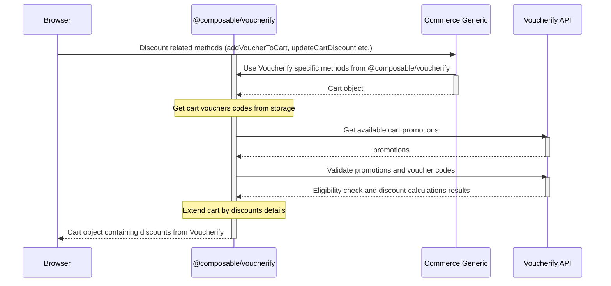

# Voucherify Integration

Voucherify is an API-first Promotions and Loyalty Engine that helps brands run personalised coupons, gift cards, auto-applied promotions, loyalty programs, and referral campaigns. This integration focuses on educating people about using Voucherify in composable commerce to enhance advanced promotions capabilities.

## Integration architecture

The application already has basic functionalities related to discounts:
- `packages/commerce-generic/src/services/cart/add-voucher.ts` - this is a service responsible for validating and adding entered vouchers to the array in the cart called: `vouchersApplied`. This service calls the `addVoucherToCart` function located in `packages/commerce-generic/src/services/cart/discount.ts`
- `packages/commerce-generic/src/services/cart/delete-voucher.ts`- this is a service responsible for removing selected vouchers from cart. This service calls the `deleteVoucherFromCart` function located in `packages/commerce-generic/src/services/cart/discount.ts`
- `packages/commerce-generic/src/services/cart/discount.ts` - main file containing the function that handles operations on discounts
- `packages/commerce-generic/src/services/checkout/create-order.ts` - when creating an order, vouchers and promotions from the cart are saved to the properties:`redeemedVouchers` and `redeemedPromotions`.

As we see above, the cart already has basic services responsible for handling discounts.
However, in order to use Voucherify as a tool for managing vouchers and promotions, it was necessary to create functions that would use Voucherify REST API.

To extend the storefront by capabilities provided by Voucherify integration a separate package called `voucherify` has been created, which contains the necessary functions needed to manage discounts.

`@composable/voucherify` dependency implements a standard checkout integration pattern, where for each cart update, the Voucherify functions make Validation (eligibility check, discount calculations) and Qualification (list of applicable promotions) requests to Voucherify REST API. Collected pieces of information extend cart data.



## Reference Files

### Backend Files

- `packages/voucherify`: This package contains functions that enhance the default behavior of functions related to discounts.

### React Components

- `composable-ui/src/components/cart/cart-vouchers.tsx`: A component that allows you to add, display, validate and delete vouchers.
- `composable-ui/src/components/forms/voucher-form.tsx`: Form used in `cart-vouchers.tsx`.
- `composable-ui/src/components/cart/cart-promotions.tsx`: Displays auto-applied cart promotions.

## Integrating Voucherify with Composable UI

### First steps

1. [Create a Voucherify account](https://app.voucherify.io/#/signup).
2. In Voucherify Dashboard, [set Discount Application Rule to "Partial"](https://support.voucherify.io/article/604-stacking-rules#application-rules)
   Please go to:
- `Redemptions` tab on the left side of the Voucherify dashboard
- Select `Stacking rules`
- In `Discounts' application rules` select `Edit settings`
- Change the `Application rule` to `Partial - inapplicable (not met criteria) discounts are omitted`
3. Retrieve your API keys from your Voucherify dashboard and set the following environment variables in `composable-ui/.env` and `scripts/.env` files:

- Go to `Project Settings` in the Voucherify dashboard
   - Click on your name in the upper right corner.
   - From the list, select `Project Settings`.
   - Find the section with `Application Keys`.
   - Copy or make a note of the `Application ID` and `Secret Key`.
   - Make a note of your [API endpoint](https://docs.voucherify.io/docs/api-endpoints).

     | Shared Cluster   | Endpoint                        |
     |------------------|---------------------------------|
     | Europe (default) | `https://api.voucherify.io`     |
     | United States    | `https://us1.api.voucherify.io` |
     | Asia (Singapore) | `https://as1.api.voucherify.io` |

Fill in the following variables with the noted values. The following three environment variables should be in both `composable-ui/.env` and `scripts/.env`.
```code
VOUCHERIFY_API_URL=https://api.voucherify.io
VOUCHERIFY_APPLICATION_ID=xxxxxxxx-xxxx-xxxx-xxxx-xxxxxxxxxxxxx
VOUCHERIFY_SECRET_KEY=xxxxxxxx-xxxx-xxxx-xxxx-xxxxxxxxxxxxx
```

**Caution:** Ensure you never expose your Voucherify API keys in the NEXT_PUBLIC_* environment variables or client-side code. Take the necessary steps to ensure that secret keys are never disclosed to the public.


### Populating the Products Using the Script (optional)

Running a script that adds products to Voucherify is optional. Without running it, you will still be able to perform validation and redemption.
However, it may be required in the future if other types of discounts are implemented.

**Note:** If you are using the free plan and sandbox project, keep in mind that it has a limit of 100 API calls per hour. 
With the basic plan you should be able to perform the `voucherify-preconfigure` action without any problems. 
However, on subsequent attempts to add products, you may get an error: `429 - TOO_MANY_REQUESTS`.
In this situation, you will only be able to make further attempts in the next hour. You can also use the app without adding products.


> **_NOTE:_**  If you are using the Free plan and Sandbox project, keep in mind that it has a limit of 100 API calls per hour.
With the basic plan you should be able to perform the `voucherify-preconfigure` action without any problems.
However, on subsequent attempts to add products, you may get an error: `429 - TOO_MANY_REQUESTS`.
In this situation, you will only be able to make further attempts in the next hour. You can also use the app without adding products - in this situation, skip this section.

To configure product base promotions in Voucherify, propagate product definitions to your Voucherify account:
1. Open the terminal and navigate to the `scripts` directory.
2. In the `scripts` directory, run the following command:
  ```
  pnpm install
  ```
3. To set up Voucherify, run the following command:
  ```
  pnpm voucherify-preconfigure
  ```

###  Enabling the use of Voucherify in the store

1. To switch between the classic implementation and the Voucherify integration you can run:  
```
pnpm voucherify-activate
``` 
in `scripts` directory.

2. This action will make commerce-generic services start using methods from `@composable/voucherify`.

**Note:** In order for the changes to take effect, a re-run of `pnpm install` from root directory is required.

3. To stop using Voucherify integration, run:
```
pnpm voucherify-deactivate
``` 
in `scripts` directory.


## Related Resources

- [Application Configuration](essentials/configuration.md)
- [Mono-repository](essentials/monorepo.md)

For more information about the configurations, see the [Application Configuration](essentials/configuration.md) section.