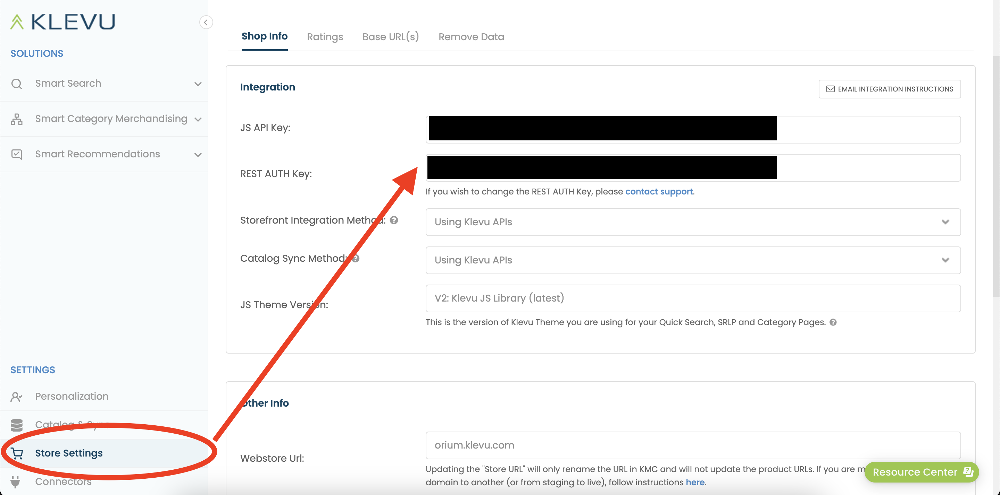
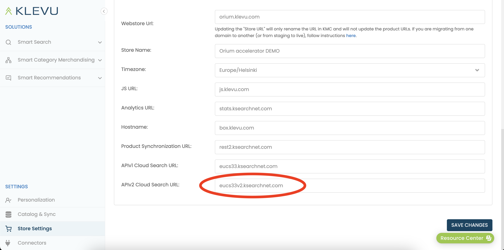
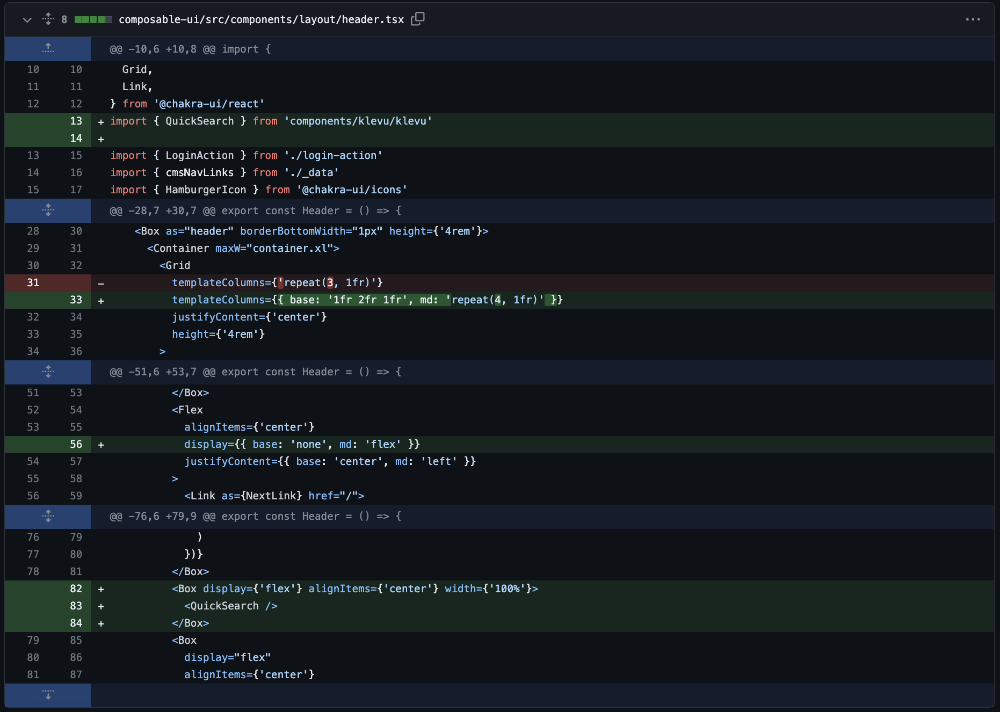

# Integrating Klevu Components into Composable-UI

## Introduction
Klevu is a powerful AI-driven search solution designed to enhance e-commerce
platforms. It offers advanced search capabilities, including autocomplete,
natural language processing, and machine learning insights to improve the user
experience. This guide outlines how to integrate Klevu components into the
Composable-UI project, enhancing your site with Klevu's robust search
functionalities.

# Data Indexing in Klevu

## Overview

Klevu provides a robust solution for indexing data to enhance the search
functionality in e-commerce platforms. This process involves the categorization
and organization of your site's content, making it searchable and improving
overall user experience.

## Account

Before starting you need a Klevu account. [You can create a trial account 
that is free for 14 days.](https://box.klevu.com/merchant/signup)

Please select API as integration method when welcome wizard asks you.

Find API and REST key from following place:



## Indexing Script
Located in the scripts folder, Klevu offers an alternative method for indexing
data. This script is tailored to interact with your site's data structure and
Klevu's search API. It's important to note that the attributes in the script
should be modified according to your specific data requirements and structure.

## Environment Variables
To securely interact with Klevu's API, you'll need to set up environment
variables in a .env file. This file should include your unique Klevu API and
REST keys, which can be found in the Klevu Merchant Center. Add these lines to
your .env file:

```env
# Klevu API key that is found in the Klevu Merchant Center
KLEVU_API_KEY=

# Klevu REST key that is found in the Klevu Merchant Center
KLEVU_REST_KEY=
```

## Modifying the Indexing Script
Before running the script, ensure that it is tailored to your site's specific
data structure. The script provided requires customization to match the
attributes and data types you wish to index. This step is crucial for accurate
and efficient search functionality.

## Running the Script
Once the script is customized and the environment variables are set, you can
execute the indexing process with the following command:

```bash
pnpm run klevu-setup
```

This command will initiate the script, which interacts with Klevu's API to index
your site's data, preparing it for an enhanced search experience.

## Getting the `display` key to work

`display` is a special property in the indexing. It can be used to pass any data
from to the frontend. But for it to work you need contact `support@klevu.com` and
request `additionalDataToReturn` to be enabled.

# Installation and Setup

1. **Navigating to the Project Directory:** Open your terminal and navigate to
   your local `composable-ui` project directory and then move to `composable-ui` subfolder.
   ```bash
   cd path/to/composable-ui/composable-ui
   ```

2. **Installing Required Packages:** Use `pnpm` to install the necessary Klevu
   packages:
   ```bash
   pnpm install @klevu/ui @klevu/ui-react @klevu/core
   ```

3. **Copy files from Klevu project to composable ui:** Move to Klevu package folder and copy files with automatic script
   ```bash
   cd ../packages/klevu
   pnpm run copyfiles
   ```

4. **Go back to composable-ui frontend project:**
   ```bash
   cd ../../composable-ui
   ```

4. **Set the env variables:** Set the `.env` variables from the Klevu project you created. 

   ```shell
   NEXT_PUBLIC_KLEVU_SEARCH_URL=YOUR_KLEVU_SEARCH_URL
   NEXT_PUBLIC_KLEVU_SEARCH_API_KEY=YOUR_KLEVU_SEARCH_API_KEY
   NEXT_PUBLIC_KLEVU_ASSETS_PATH=http://localhost:3000
   ```

   `SEARCH_URL` format is following `https://[your Klevu API v2 search url]/cs/v2/search`

   `ASSETS_PATH` is full url to your installation. It is required for icons to load properly.

   You can find the Search URL in the same Store settings as the `API key` and `REST key`

   


5. **Adding styles:** Add following two imports to `composable-ui/pages/_app.tsx`

   ```typescript
   import '@klevu/ui/dist/klevu-ui/klevu-ui.css'
   import 'klevustyle.css'
   ```

   You can modify the look and feel of the Klevu Components with `src/klevustyle.css`


6. **Adding QuickSearch Component:** Integrate the `QuickSearch` component into
   the header:
   - First, open `composable-ui/src/components/layout/header.tsx`.
   - Import the `QuickSearch` component:
     ```javascript
     import { QuickSearch } from 'components/klevu/klevu';
     ```
   - Add the `<QuickSearch />` component to the desired location within the
     `header.tsx` file.

   Here is a example of placement code: 


## Running the Project
After completing the above steps, you can start the project to see the Klevu
components in action:
```bash
pnpm run dev
```
